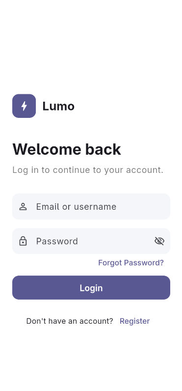
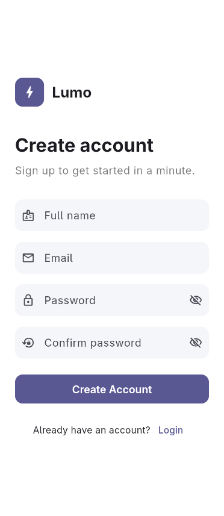

# Lumo – Login & Registration UI

## Short Description

Lumo is a Flutter mobile app that demonstrates a clean, minimal Login and Registration interface. It focuses on modern UI design, reusable widgets, form validation, and navigation between screens.

## Features

**Login Page**
- App logo and name
- Email / Username input field
- Password input field with show/hide toggle
- Login button with form validation
- "Forgot Password?" option
- Link to navigate to the Registration page

**Registration Page**
- App logo and name
- Full Name, Email, Password, and Confirm Password fields
- Show/hide toggle on both password fields
- Validation for required fields, email format, minimum password length, and matching passwords
- Create Account button
- Link to navigate back to the Login page

**General**
- Minimal Material 3 design with a consistent theme
- Reusable custom widgets (`AppTextField`, `AuthHeader`)
- Scrollable layout that avoids overflow when the keyboard is open

## Screenshots

| Login Page | Registration Page |
|:----------:|:-----------------:|
|  |  |

## Technologies Used

- [Flutter](https://flutter.dev/)
- [Dart](https://dart.dev/)
- Material 3 design

## How to Run the Project

1. **Install Flutter** by following the [official guide](https://docs.flutter.dev/get-started/install), then confirm the setup:
   ```bash
   flutter doctor
   ```

2. **Clone the repository**
   ```bash
   git clone https://github.com/AlastrimDEV/flutter-login-register-page
   cd <project-folder>
   ```

3. **Install dependencies**
   ```bash
   flutter pub get
   ```

4. **Start an emulator or connect a device**, then check it is detected:
   ```bash
   flutter devices
   ```

5. **Run the app**
   ```bash
   flutter run
   ```

## Project Structure

```
lib/
├── main.dart
├── pages/
│   ├── login_page.dart
│   └── register_page.dart
└── widgets/
    ├── app_text_field.dart
    └── auth_header.dart
screenshots/
├── login.png
└── register.png
```